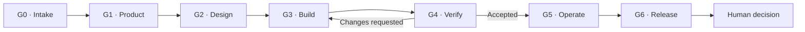

# Adaptive Agent Fleet

Adaptive Agent Fleet is a production-oriented Codex configuration for managing
software projects from initial discovery to release readiness. It provides one
orchestrator and twelve specialists, each with a single responsibility, explicit
authority boundaries, structured outputs, and human approval gates.

The fleet is adaptive: the orchestrator invokes only the roles required by the
current scope and risk instead of forcing every change through every specialist.

## Core Capabilities

- End-to-end routing across product, design, architecture, engineering, quality,
  security, delivery, documentation, reliability, and release management.
- Evidence-based gates from intake through release readiness.
- Parallel execution for independent assignments, limited to three concurrent
  threads per session.
- Independent review and bounded correction loops.
- Read-only reviewer and coordinator roles where write access is unnecessary.
- Mandatory human approval for production actions and consequential risk
  acceptance.
- Version-controlled agent behavior, workflow policy, and handoff contracts.

## Delivery Lifecycle



Each gate requires current, verifiable evidence. Failed criteria return to the
responsible author and must be independently revalidated. After three failed
correction attempts at the same gate, the orchestrator escalates the decision to
the human owner.

See [the orchestration workflow](../orchestration/workflow.md) for the complete
routing and approval model.

## Agent Fleet

| Agent | Primary responsibility | Workspace access |
|---|---|---|
| `orchestrator` | Plan, route, coordinate, and escalate | Read-only |
| `product_manager` | Define outcomes, scope, priorities, and acceptance criteria | Workspace write |
| `user_researcher` | Plan ethical research and synthesize authorized evidence | Read-only |
| `ux_ui_designer` | Specify accessible user journeys and interfaces | Workspace write |
| `solution_architect` | Define architecture decisions and implementation boundaries | Read-only |
| `data_engineer` | Design data contracts, migrations, quality, and lifecycle controls | Workspace write |
| `implementation_engineer` | Implement bounded product changes and tests | Workspace write |
| `qa_reviewer` | Independently verify behavior and regressions | Read-only |
| `security_engineer` | Assess threats, vulnerabilities, and remediation | Read-only |
| `devops_engineer` | Build delivery pipelines, environments, and runbooks | Workspace write |
| `documentation_writer` | Maintain accurate, durable project documentation | Workspace write |
| `site_reliability_engineer` | Define reliability, observability, and incident response | Workspace write |
| `release_manager` | Consolidate release evidence and readiness | Read-only |

Executable agent definitions live in [`.codex/agents`](../../.codex/agents).
Shared runtime settings live in [`.codex/config.toml`](../../.codex/config.toml).

## Getting Started

### Prerequisites

- Git
- Codex with custom agent support

### Installation

```bash
git clone https://github.com/Malky-dev/agents.git
cd agents
git switch develop
```

Open the repository as your Codex workspace. The project-level configuration
enables the custom agents automatically for that workspace.

### Start a Project

Give the orchestrator a project brief containing:

- the problem to solve;
- target users and expected outcomes;
- included and excluded scope;
- business, technical, budget, and timeline constraints;
- known risks and dependencies;
- measurable acceptance criteria.

Example request:

```text
Coordinate this project from discovery to release readiness. Clarify material
unknowns before assigning work, use only the necessary specialists, preserve
evidence at each gate, and stop for every required human approval.
```

The orchestrator will clarify consequential unknowns, select the required agents,
create bounded assignments, track gate evidence, coordinate corrections, and ask
for approval before any production action.

## Repository Structure

```text
.
├── .codex/
│   ├── agents/                 # Executable agent definitions
│   └── config.toml             # Fleet runtime settings
├── docs/
│   ├── handoffs/TEMPLATE.md    # Durable handoff contract
│   └── orchestration/workflow.md
├── AGENTS.md                   # Shared operating and Git policy
└── README.md                   # Project overview and usage
```

## Safety Model

The fleet never treats missing evidence as approval. Authors do not validate
their own work. High or critical risks cannot be accepted by an agent. Merging
`develop` into `main`, production deployment, production data access, destructive
operations, and material external writes always require explicit human approval.

## Documentation

- [Changelog](CHANGELOG.md)
- [Operating policy](../../AGENTS.md)
- [Orchestration workflow](../orchestration/workflow.md)
- [Handoff template](../handoffs/TEMPLATE.md)
- [Official Codex custom-agent documentation](https://learn.chatgpt.com/docs/agent-configuration/subagents)
